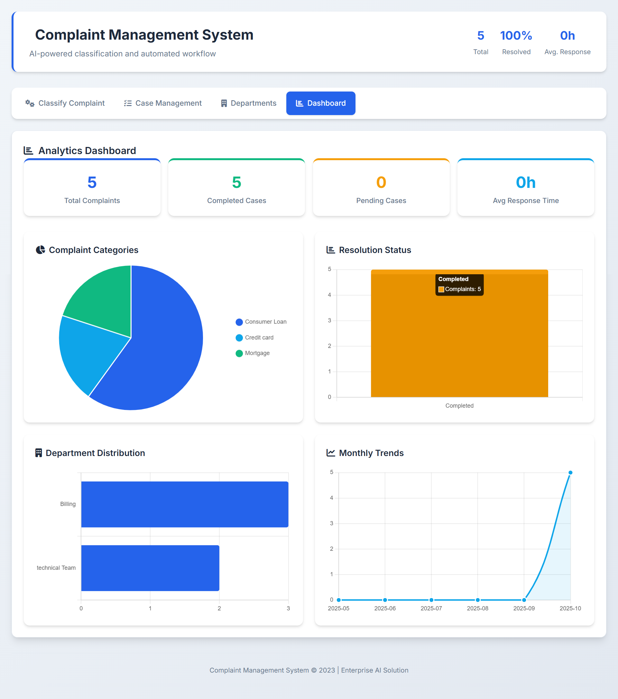
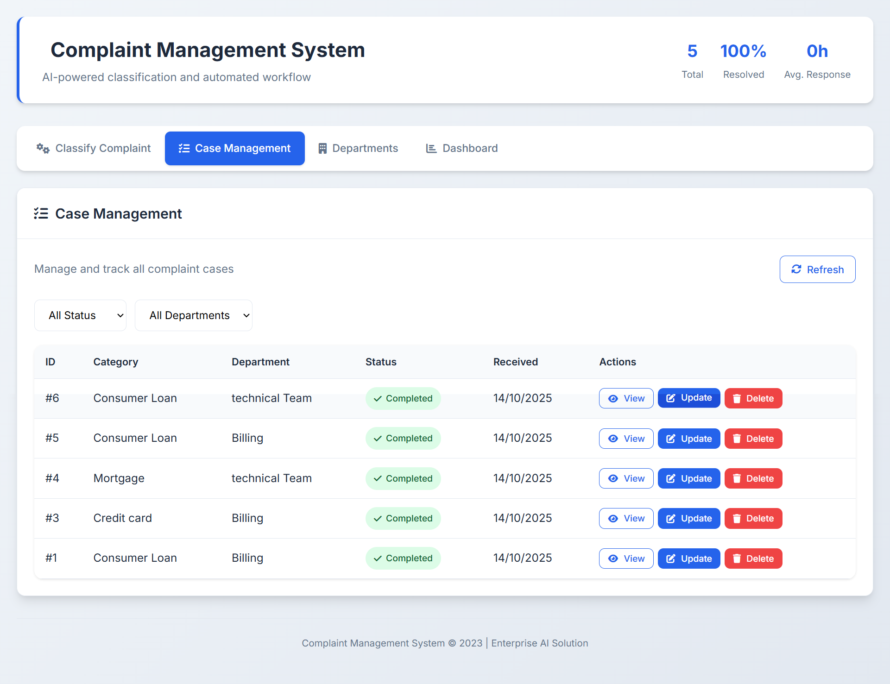
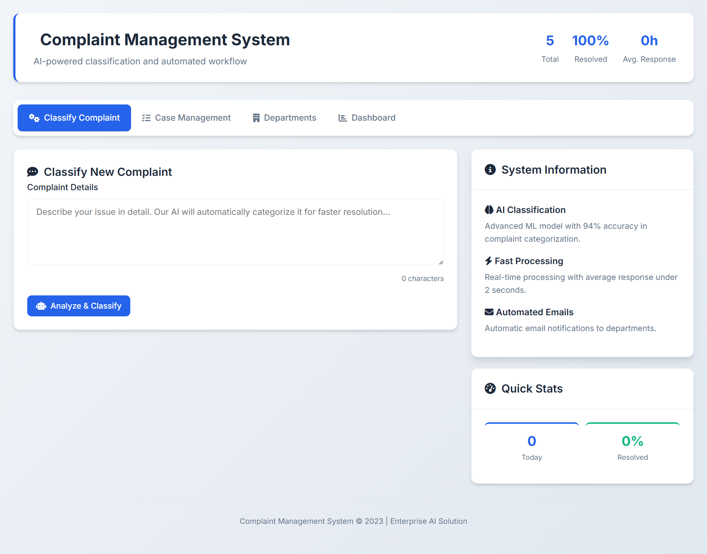
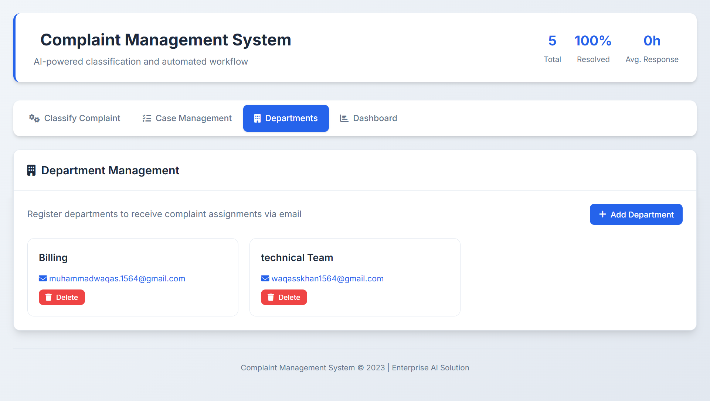
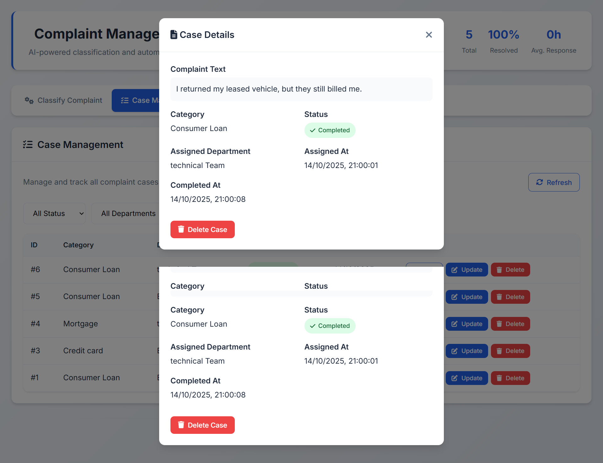

# 🧠 AI-Powered Complaint Management System

<div align="center">


**🚀 AI-powered complaint classification and automated workflow management system**

[Features](#-features) • [Installation](#-installation) • [Usage](#-usage) • [Screenshots](#-screenshots) • [API](#-api) • [Contributing](#-contributing) • [License](#-license)

</div>

---

## 🧩 Overview

The **AI-Powered Complaint Management System** is an enterprise-grade web application that leverages **Machine Learning** and **Flask** to automatically classify customer complaints, assign them to relevant departments, and track their resolution.

It includes smart routing, automated email notifications, analytics dashboards, and workflow management — all in a simple and elegant interface.

---

## ✨ Features

### 🤖 AI-Powered Classification

- Automatically classifies complaints using a pre-trained ML model
- Real-time predictions with **94%+ accuracy**
- Multi-category classification using **TF-IDF** and **Logistic Regression**

### 🏢 Department Management

- Register and manage departments with assigned email addresses
- Automatic routing of new complaints
- Email notifications for new case assignments

### 🗂️ Case Management

- End-to-end complaint lifecycle tracking
- Case status updates: Pending, Assigned, Completed
- Case reassignment and deletion options

### 📊 Analytics Dashboard

- Interactive visualizations with **Chart.js**
- Monthly trend analysis
- Department performance metrics
- Complaint category distribution

### ⚙️ Automated Workflows

- Email notifications for updates and completions
- Real-time complaint status updates
- Scalable backend ready for cloud deployment

---


## 🖼️ Screenshots

Take a look at the **AI-Powered Complaint Management System** 👇  

### 🧭 Dashboard  


---

### 📝 Case Management


---

###  Classify Complaint


---

###  Departments 


---

### Delete or Update Complaint 


> 💡 Each screenshot represents a key feature of the system — from complaint submission to AI-based routing and analytics.


## 🧠 Technology Stack

| Layer                 | Technologies                      |
| --------------------- | --------------------------------- |
| **Backend**           | Flask, Python                     |
| **Frontend**          | HTML5, CSS3, JavaScript, Chart.js |
| **Database**          | SQLite                            |
| **Machine Learning**  | Scikit-learn, Joblib              |
| **Email Integration** | SMTP                              |
| **UI Frameworks**     | Font Awesome, Custom CSS          |

---

## ⚙️ Installation

### Prerequisites

Make sure you have:

- **Python 3.8+**
- **pip** (Python package manager)
- **Git**

### Steps

```bash
# 1️⃣ Clone the repository
git clone https://github.com/waqas-gul/Ai-Powered-Complaint-Management-System-main.git

# 2️⃣ Navigate into the folder
cd Ai-Powered-Complaint-Management-System

# 3️⃣ Create a virtual environment
python -m venv venv
venv\Scripts\activate   # for Windows
# or
source venv/bin/activate  # for macOS/Linux

# 4️⃣ Install dependencies
pip install -r requirements.txt

# 5️⃣ Run the application
python app.py
```
